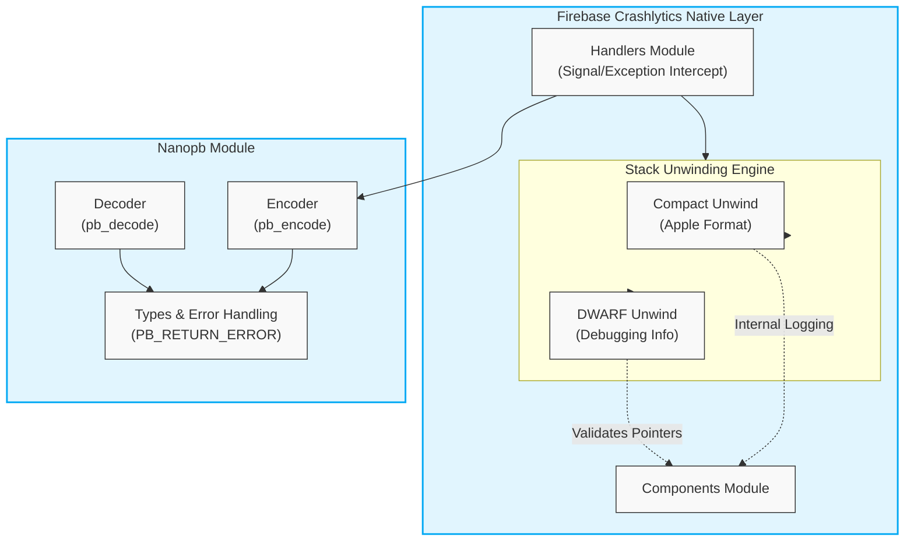

# Architecture: Posemate

This document provides a high-level architectural overview of the `posemate` codebase, generated from the GitNexus code intelligence knowledge graph.

## Overview

- **Files:** 3,424
- **Symbols:** 9,156
- **Execution Flows (Processes):** 212

*Note: The current GitNexus index heavily reflects the native iOS dependency layer (CocoaPods/Firebase Crashlytics/Nanopb), which provides low-level crash reporting, stack unwinding, and Protocol Buffer serialization.*

## Functional Areas (Clusters)

Based on cohesion analysis of the knowledge graph, the codebase is grouped into the following primary functional modules:

1. **Nanopb** (87 symbols, 82% cohesion): A lightweight Protocol Buffers implementation in C, used for encoding and decoding structured data telemetry.
2. **Dwarf** (86 symbols, 84% cohesion): Handles DWARF debugging information format parsing, specifically for unwinding the stack during crash reporting.
3. **Unwind** (53 symbols, 72% cohesion): Core stack unwinding logic for native crashes.
4. **Handlers** (29 symbols, 81% cohesion): Exception and signal handlers that intercept crashes.
5. **Components** (23 symbols, 73% cohesion): Auxiliary Firebase components.
6. **Compact** (15 symbols, 84% cohesion): Compact unwind formatting (Apple-specific unwind information).

## Key Execution Flows

The top 5 most critical cross-community execution flows (processes) trace deep through the native crash reporting and serialization layers:

### 1. `Pb_dec_submessage → PB_RETURN_ERROR`
Protocol Buffer decoding fallback/error flow.
- `pb_dec_submessage` -> `pb_decode` -> `pb_decode_noinit` -> `pb_decode_tag` -> `pb_decode_varint32_eof` -> `pb_readbyte` -> `PB_RETURN_ERROR`

### 2. `Pb_decode_nullterminated → PB_RETURN_ERROR`
Handling null-terminated Protocol Buffer payloads.
- `pb_decode_nullterminated` -> `pb_decode` -> `pb_decode_noinit` -> `pb_decode_tag` -> `pb_decode_varint32_eof` -> `pb_readbyte` -> `PB_RETURN_ERROR`

### 3. `FIRCLSDwarfExpressionMachineExecuteNextOpcode → FIRCLSIsValidPointer`
DWARF expression execution during stack unwinding.
- `FIRCLSDwarfExpressionMachineExecuteNextOpcode` -> `FIRCLSDwarfExpressionMachineExecute_deref` -> `FIRCLSDwarfExpressionMachineStackPop` -> `FIRCLSDwarfExpressionStackPop` -> `FIRCLSDwarfExpressionStackIsValid` -> `FIRCLSIsValidPointer`

### 4. `FIRCLSCompactUnwindLookupAndCompute → FIRCLSCompactUnwindGetIndexFunctionOffset`
Looking up compact unwind information for a specific program counter.
- `FIRCLSCompactUnwindLookupAndCompute` -> `FIRCLSCompactUnwindLookup` -> `FIRCLSCompactUnwindLookupSecondLevel` -> `FIRCLSCompactUnwindLookupSecondLevelCompressed` -> `FIRCLSCompactUnwindGetTargetAddress` -> `FIRCLSCompactUnwindGetIndexFunctionOffset`

### 5. `FIRCLSCompactUnwindLookupAndCompute → FIRCLSSDKLog`
Logging mechanism triggered during compact unwind lookup failures.
- `FIRCLSCompactUnwindLookupAndCompute` -> `FIRCLSCompactUnwindLookup` -> `FIRCLSCompactUnwindLookupSecondLevel` -> `FIRCLSCompactUnwindLookupSecondLevelCompressed` -> `FIRCLSCompactUnwindGetTargetAddress` -> `FIRCLSSDKLog`

## Architecture Diagram

Below is a Mermaid diagram visualizing the interaction between the primary clusters based on the execution flows:

