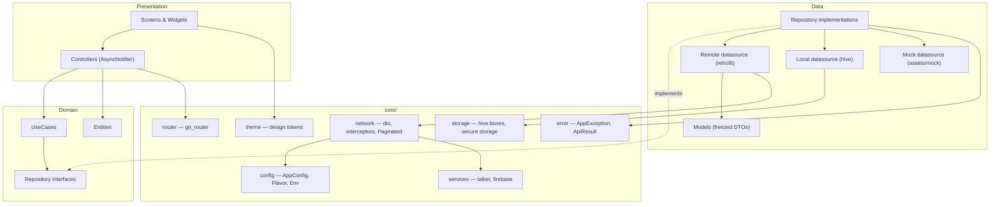
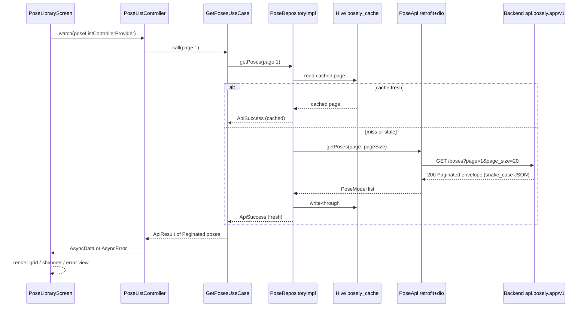
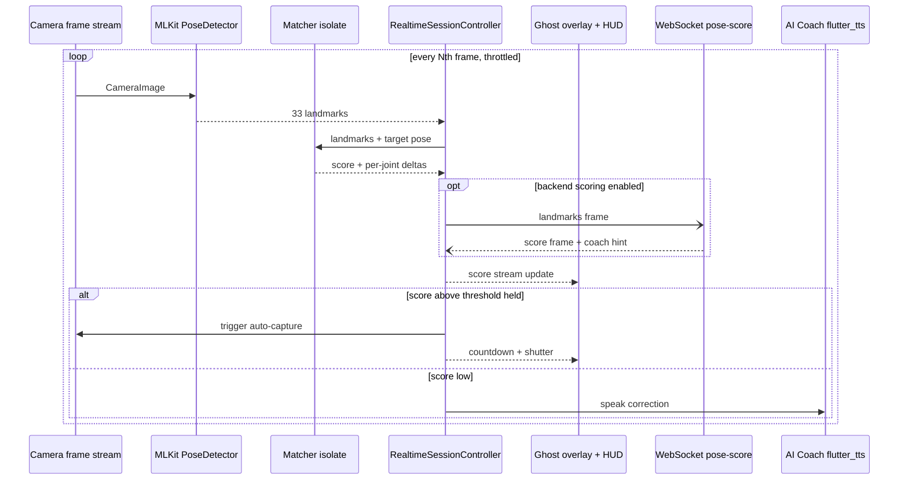

# Architecture

Posely AI is built as a layered Clean Architecture, organized feature-first, with Riverpod 3 for dependency injection and state, go_router for navigation, and a Dio/Retrofit network stack. This document defines the rules; [FOLDER_STRUCTURE.md](FOLDER_STRUCTURE.md) maps them to directories.

## Layers and the dependency rule

Each feature is split into three layers:

- **Presentation** — screens, widgets, and `AsyncNotifier` controllers. Knows about the domain, never about the data layer.
- **Domain** — pure Dart: entities, repository *interfaces*, and use cases. Depends on nothing but the core error/result types. No Flutter, no Dio, no Hive.
- **Data** — repository *implementations*, datasources (remote / local / mock), and freezed DTO models that map to/from wire JSON and to domain entities.

Dependencies point inward: **presentation → domain ← data**. The data layer implements domain interfaces; presentation consumes domain types only. Wiring happens in Riverpod providers, so swapping a remote datasource for the mock one (dev flavor, `AppConfig.useMockData`) is a provider decision, invisible to domain and presentation.

`lib/core/` sits beneath all features and hosts the cross-cutting machinery: config/flavors, theme, router, error/result types, the network stack, storage, services (logging, Firebase), and shared widgets/utilities.

## Why feature-first

Vertical slices (`lib/features/<feature>/`) keep everything a feature needs — screens, controllers, use cases, models — in one place. This scales with the 15-phase roadmap: each phase lands mostly inside one feature directory, reviews stay local, and deleting or rewriting a feature does not ripple across the app. The alternative (layer-first: one global `models/`, `screens/`, …) turns every feature into a scavenger hunt and every merge into a conflict. Cross-feature code is not shared sideways; it is promoted to `core/` (see import rules in [FOLDER_STRUCTURE.md](FOLDER_STRUCTURE.md)).

## State management conventions

- **Riverpod 3** everywhere; no `setState` beyond trivial local widget state (e.g. an animation toggle).
- **Core uses manual providers** — `appConfigProvider`, `dioProvider`, `talkerProvider`, `localStorageProvider`, etc. are hand-written `Provider`s. `appConfigProvider`, `localStorageProvider`, and `talkerProvider` throw `UnimplementedError` unless overridden; `bootstrap()` overrides them on the root `ProviderScope` with the flavor's concrete values.
- **Features may use riverpod codegen** (`@riverpod`) for controllers and feature-level providers.
- **Controllers are `AsyncNotifier`s** named `<Thing>Controller`, exposing `AsyncValue<State>`. They orchestrate use cases and fold results into state; they contain no widget code.
- **No logic in widgets.** Screens `watch` controllers and render `AsyncValue` states (loading / data / error); user intent is forwarded to controller methods. Formatting-only helpers may live in widgets.
- The `TalkerRiverpodObserver` installed in `bootstrap()` logs provider failures for diagnosis.

## Error-handling policy

One pipeline, no exceptions crossing layer boundaries unhandled:

1. **Datasources throw `AppException`** — a sealed hierarchy in `core/error/` (network, timeout, unauthorized, validation, server, cache, unknown). Dio errors are mapped at the datasource/interceptor boundary.
2. **Repositories return `ApiResult<T>`** — `ApiSuccess<T>` or `ApiFailure<T>` — by wrapping datasource calls in `guardApi()`, which catches `AppException` (and anything else, mapped to unknown) and never lets it escape.
3. **Controllers fold `ApiResult` into `AsyncValue`** — success becomes `AsyncData`, failure becomes `AsyncError` carrying the typed exception.
4. **UI renders states** — screens switch on the `AsyncValue` and show content, skeletons/shimmer, or a typed error view (retry for network, sign-in prompt for auth, field messages for validation).

Global last-resort handlers are installed in `bootstrap()` (Talker) and replaced by Crashlytics-backed handlers when Firebase is enabled (`FirebaseBootstrapper`).

## Navigation strategy

- **go_router 17**, configured once in `core/router/` and exposed via `appRouterProvider`; `PoselyApp` mounts it with `MaterialApp.router`.
- Route paths and names are centralized constants; screens navigate by name, never by string literals.
- A bottom-navigation **shell route** hosts the main tabs (Home, Library, Camera, Gallery, Profile) with per-tab state preservation.
- **Redirects handle guarding**: splash → onboarding/auth → shell, driven by auth state (Phase 3) and premium entitlements for gated routes (Phase 12). Guard logic reads providers; widgets never decide access.
- Deep links (poses, community posts) map onto the same route table.

## Offline & cache strategy

- **Hive CE** boxes: `posely_settings` (preferences), `posely_cache` (API response cache), `posely_poses` (saved poses/collections). Tokens never touch Hive — they live in `flutter_secure_storage` behind `SecureTokenStorage`.
- **Cache-aside** in repositories: read cache first, serve if fresh, otherwise fetch remote, write through, return fresh data. Failures on a warm cache degrade to stale data with a failure surfaced as a non-fatal notice.
- `cached_network_image` handles image caching independently.
- Phase 13 hardens this: TTL and eviction policies per box, cache versioning/migration, an offline mutation queue, and connectivity-aware refresh via `connectivity_plus`.

### Sequence: browse poses

## Realtime pipeline (AI camera)

The realtime loop is latency-critical and stays off the UI thread wherever possible:

1. **Camera** streams frames (`camera` plugin); processing is throttled to every Nth frame.
2. **ML Kit pose detection** extracts 33 landmarks on-device (`google_mlkit_pose_detection`); face detection and selfie segmentation feed the ghost-overlay renderer.
3. **Matcher isolate** compares detected landmarks against the target pose (normalized joint angles) and emits a similarity score plus per-joint deltas.
4. **Score stream → UI**: the session controller exposes a score stream; the overlay tints the silhouette, the HUD shows the score, and the AI coach speaks corrections (`flutter_tts`). When the score holds above threshold, auto-capture fires.
5. **Optional WebSocket backend** (`wss://realtime.<env>.posely.app/v1/ai/pose-score` via `web_socket_channel`) provides server-side scoring/coaching for premium sessions; the on-device path always works standalone.

`wakelock_plus` keeps the screen on during sessions; `sensors_plus` powers the level indicator.

### Sequence: AI camera realtime loop

## Cross-cutting concerns

| Concern | Mechanism |
| --- | --- |
| Configuration | `AppConfig.forFlavor` (dev/uat/prod), injected via `appConfigProvider` override in `bootstrap()` |
| Networking | `dioProvider`: base URL from config, `AuthInterceptor` (Bearer from `SecureTokenStorage`; 401 clears tokens — refresh rotation lands in Phase 3), `RetryInterceptor` (idempotent GETs, 2 retries, exponential backoff + jitter), `TalkerDioLogger` |
| Logging | Talker (`talkerProvider`), Dio + Riverpod observers; Crashlytics when Firebase is on |
| Pagination | `Paginated<T>` freezed envelope — `items / page / page_size / total_items / has_more` (see [API_CONTRACTS.md](API_CONTRACTS.md)) |
| Mock mode | `AppConfig.useMockData` (dev = true) routes repositories to mock datasources backed by `assets/mock/` |
| Firebase | Off in all flavors until per-flavor `flutterfire configure` (see [FIREBASE_SETUP.md](FIREBASE_SETUP.md)) |
